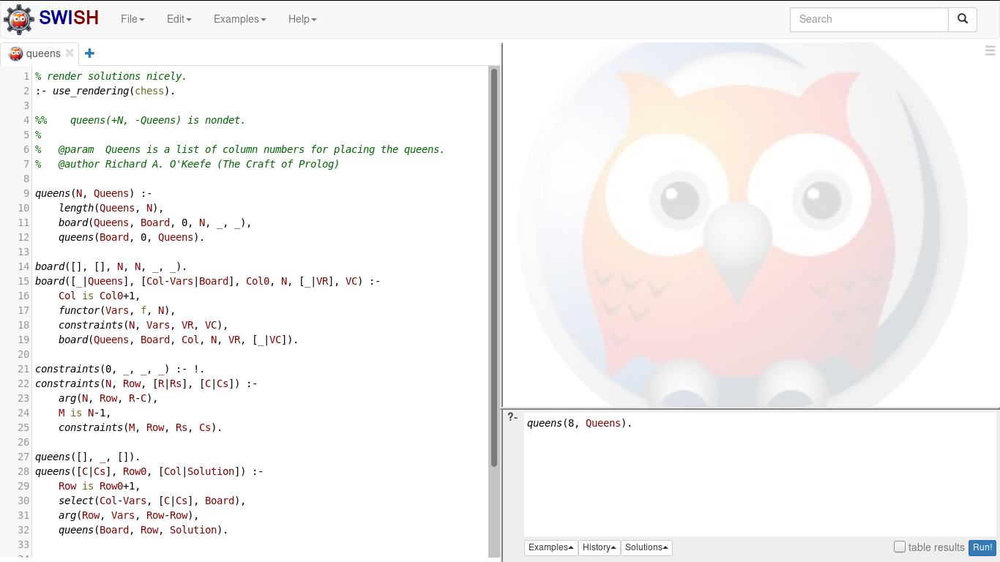
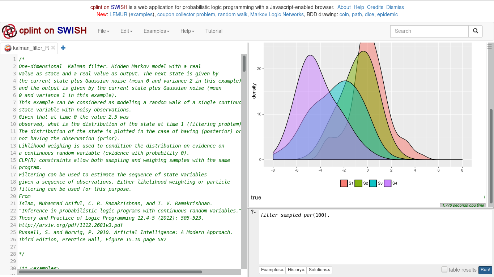
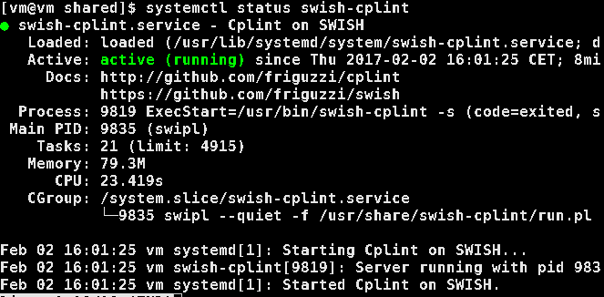

# swish-installer

A set of packages that are able to build and install
[SWISH](https://github.com/SWI-Prolog/swish), 
[Cplint on SWISH](https://github.com/friguzzi/swish) 
with an 
[R environment and library](https://github.com/frnmst/cplint_r).

[Full Documentation](https://frnmst.github.io/swish-installer)

[Supported and tested distributions](https://frnmst.github.io/swish-installer/swish-installer.html#Tests)

## Warning

There is a possibility that some software component is proprietary.
Since lots of external programs are used, it's difficult to check them one 
by one.

## License

Copyright (C) 2016 frnmst (Franco Masotti) <franco.masotti@student.unife.it>

swish-installer is free software: you can redistribute it and/or modify it 
under the terms of the GNU General Public License as published by the Free Software 
Foundation, either version 3 of the License, or (at your option) any later 
version.
