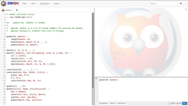

# swish-installer

A set of packages that are able to build and install
[SWISH](https://github.com/SWI-Prolog/swish), 
[Cplint on SWISH](https://github.com/friguzzi/swish) 
with an 
[R environment and library](https://github.com/frnmst/cplint_r).

## Instructions

[Documentation](https://frnmst.github.io/swish-installer)

## Supported and tested distributions

Only GNU/Linux Arch-based distros are currently supported.

### [qvm](https://github.com/frnmst/qvm)

- GNU/Linux-libre distribution Parabola.
- GNU/Linux distribution Antergos.

### VirtualBox and OS Boxes

- GNU/Linux distribution Arch.

## Warning

I'm not 100% sure that all the software present in
every component is free (libre) software. Since lots of external
components are used, it's difficult to check them one by one.

## License

Copyright (C) 2016 frnmst (Franco Masotti) <franco.masotti@student.unife.it>

swish-installer is free software: you can redistribute it and/or modify it 
under the terms of the GNU General Public License as published by the Free Software 
Foundation, either version 3 of the License, or (at your option) any later 
version.
